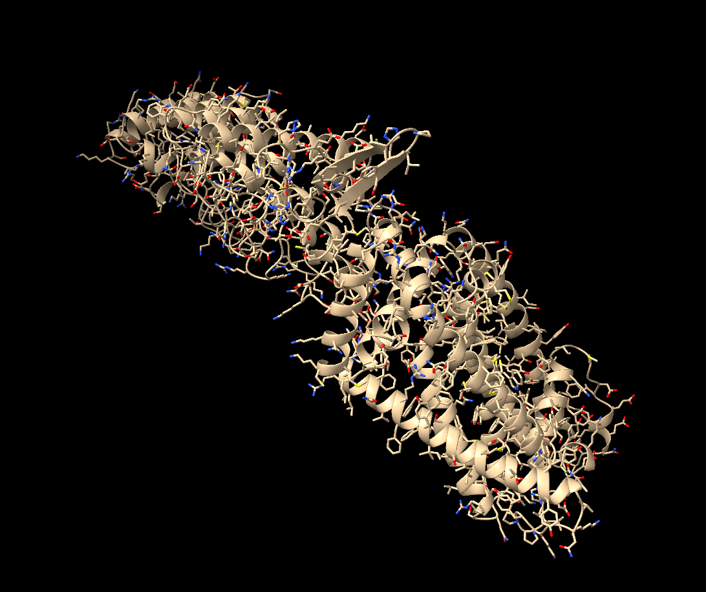

# SimpleFold For AWS HealthOmics

 

Includes Docker container and Terraform infrastructure for running [SimpleFold](https://github.com/apple/ml-simplefold) protein structure prediction on AWS HealthOmics. This container packages SimpleFold with all required dependencies for use in Nextflow workflows.

```
>3J5R_1|Chains A, B, C, D|Transient receptor potential cation channel subfamily V member 1|Rattus norvegicus (10116)
LYDRRSIFDAVAQSNCQELESLLPFLQRSKKRLTDSEFKDPETGKTCLLKAMLNLHNGQNDTIALLLDVARKTDSLKQFVNASYTDSYYKGQTALHIAIERRNMTLVTLLVENGADVQAAANGDFFKKTKGRPGFYFGELPLSLAACTNQLAIVKFLLQNSWQPADISARDSVGNTVLHALVEVADNTVDNTKFVTSMYNEILILGAKLHPTLKLEEITNRKGLTPLALAASSGKIGVLAYILQREIHEPECRHLSRKFTEWAYGPVHSSLYDLSCIDTCEKNSVLEVIAYSSSETPNRHDMLLVEPLNRLLQDKWDRFVKRIFYFNFFVYCLYMIIFTAAAYYRPVEGLPPYKLKNTVGDYFRVTGEILSVSGGVYFFFRGIQYFLQRRPSLKSLFVDSYSEILFFVQSLFMLVSVVLYFSQRKEYVASMVFSLAMGWTNMLYYTRGFQQMGIYAVMIEKMILRDLCRFMFVYLVFLFGFSTAVVTLIEDGKYNSLYSTCLELFKFTIGMGDLEFTENYDFKAVFIILLLAYVILTYILLLNMLIALMGETVNKIAQESKNIWKLQRAITILDTEKSFLKCMRKAXXXXXXXXXXXX
```

<div align="center">↓↓↓</div>



## Features

- **SimpleFold ML Model**: Apple's SimpleFold protein structure prediction model
- **PyTorch Backend**: CUDA-optimized for GPU inference
- **Redis Integration**: CCD database for mmCIF processing
- **Ready for HealthOmics**: Pre-configured for AWS HealthOmics workflows
- **Automated Setup**: One-click deployment with Terraform

## Quick Start

### Prerequisites

- Docker
- Terraform
- AWS CLI
- Nextflow (optional, for local testing)

### Deployment with Terraform

Use Terraform to automatically create nessesarry AWS resources and deploy the HealthOmics workflow:

```bash
# Clone repository
git clone https://github.com/bioteam/aho-simplefold.git

# Navigate to terraform directory
cd aho-simplefold/terraform

# Copy the example variables file and customize
cp terraform.tfvars.example terraform.tfvars

# Edit terraform.tfvars with your specific values
vi terraform.tfvars

# Initialize Terraform
terraform init

# Plan the deployment
terraform plan

# Apply the configuration
terraform apply
```

The Terraform configuration will:
1. ✅ Create S3 bucket for data storage
2. ✅ Create ECR repository for container images
3. ✅ Create IAM execution role with necessary permissions
4. ✅ Set up necessary AWS resources for HealthOmics workflows
5. ✅ Output configuration values for use in workflows

### Build Container and Push to ECR

After Terraform creates the nessesarry AWS resources, build the Docker container and push it to the created ECR repository:

#### Using Make Commands (Recommended)

```bash
# Return to the root repository directory
cd ..

# Complete deployment: build, login, and push
make deploy-container
```

#### Granular Make Commands (Alternative)

```bash
# Build container and tag with ECR repository URL
make build

# Authenticate Docker to ECR
make login

# Upload container to ECR
make push
```

#### Raw Docker Commands (For Reference)

<details>
<summary>Click to expand manual docker commands</summary>

```bash
# Build container and tag with ECR repository URL
docker build --platform=linux/amd64 -t $(cd terraform && terraform output -raw ecr_repository_url):latest .

# Authenticate Docker to ECR
aws ecr get-login-password --region $(cd terraform && terraform output -raw aws_region) | docker login --username AWS --password-stdin $(cd terraform && terraform output -raw ecr_repository_url)

# Upload container to ECR
docker push $(cd terraform && terraform output -raw ecr_repository_url):latest
```

</details>

### Make Targets Summary

Avaliable Makefile targets for common operations:

```bash
# View all available commands
make help

# Complete deployment pipeline
make deploy    # Build, login to ECR, and push container

# Individual steps
make build     # Build Docker container
make login     # Login to ECR
make push      # Push container to ECR
make run       # Start HealthOmics workflow run
make clean     # Remove local Docker images
```

## AWS HealthOmics Usage

After running Terraform apply, you'll have everything configured for HealthOmics:

### 1. Upload Input Files

```bash
# Upload your FASTA files to the S3 input directory, assuming working directory  at root of repository
aws s3 cp your_protein.fasta s3://$(cd terraform && terraform output -raw s3_bucket_name)/input/
```

**Note:** This Nextflow workflow processes all FASTA files in the input directory. Multiple sequences can be included in a single FASTA file - the records will be split into separate files and processed automatically. 

### 2. Run Workflow

#### Using Make Command (Recommended)

```bash
# Start a workflow run (uses values from Terraform outputs)
make run
```

#### Manual AWS CLI Command (Alternative)

<details>
<summary>Click to expand manual docker commands</summary>

```bash
# Start a workflow run (use values from Terraform outputs)
aws omics start-run \
    --role-arn "$(cd terraform && terraform output -raw execution_role_arn)" \
    --output-uri "s3://$(cd terraform && terraform output -raw s3_bucket_name)/out/" \
    --parameters "{\"input_dir\": \"s3://$(cd terraform && terraform output -raw s3_bucket_name)/input/\"}" \
    --workflow-id "$(cd terraform && terraform output -raw workflow_id)" \
    --name "simplefold-run-$(date +%Y%m%d-%H%M%S)"
```

</details>

### Resource Configuration Reference

Default resource allocation per job:
- **CPU**: 4 cores
- **Memory**: 32 GB
- **GPU**: 1x NVIDIA L40S (HealthOmics)
- **Storage**: Auto-provisioned (HealthOmics)

See `workflow/main.nf` for task-specific resource settings.

## Configuration

### Nextflow Parameters

The workflow supports the following parameters (configured in `workflow/nextflow.config.tpl`):

```groovy
params {
    // SimpleFold model settings
    simplefold_model = 'simplefold_100M'  // Model variant: simplefold_100M/360M/700M/1.1B/1.6B/3B
    num_steps = 500                       // Sampling steps
    tau = 0.01                            // Temperature parameter
    nsample_per_protein = 1               // Samples per protein
    enable_plddt = true                   // Enable pLDDT confidence scores
    
    // input path in S3 bucket
    input_dir = 's3://your-bucket/input/'
}
```

Terraform will automatically create a `nextflow.config` file from the template. If this configuration is modified, you must re-run `terraform apply` to update the workflow definition in S3.

### Manually Create HealthOmics Workflow (Optional Reference)

You may also manually create the HealthOmics workflow definition via AWS Console or CLI, rather than using Terraform. To do so, first package and upload the workflow definition:

```bash
# Edit parameters as needed
cp workflow/nextflow.config.tpl workflow/nextflow.config
vi workflow/nextflow.config 

# Package and upload workflow definition
zip -r simplefold-workflow.zip workflow/
aws s3 cp simplefold-workflow.zip s3://$(terraform output -raw s3_bucket_name)/workflows/

# Create workflow definition in AWS Console or via CLI
WORKFLOW_ID=$(aws omics create-workflow \
    --name "SimpleFold-Workflow" \
    --engine "NEXTFLOW" \
    --no-cli-pager \
    --query 'id' --output text \
    --definition-uri s3://$(cd terraform && terraform output -raw s3_bucket_name)/workflows/simplefold-workflow.zip)
```

## Local Testing With Docker

### Run Local Protein Structure Prediction With Docker

```bash
docker run --gpus all --platform=linux/amd64 --rm \
  -v $(pwd)/input:/app/input \
  -v $(pwd)/output:/app/output \
  simplefold \
  simplefold --simplefold_model simplefold_100M \
    --num_steps 500 --tau 0.01 \
    --nsample_per_protein 1 --plddt \
    --fasta_path /app/input/3d06.fasta \
    --backend torch \
    --output_dir /app/output
```

## Output Files

SimpleFold generates several output files:

- **`.cif` files**: Protein structure in mmCIF format
- **`.json` files**: Prediction metadata and confidence scores
- **`.npz` files**: Raw embeddings and intermediate representations

## Troubleshooting

### Common Issues

1. **Docker Build Fails**
   - Ensure Docker is running and you have sufficient disk space
   - Check CUDA compatibility if using GPU features

2. **AWS Permissions**
   - Verify AWS CLI is configured: `aws sts get-caller-identity`
   - Ensure your user has permissions to create IAM roles, S3 buckets, and ECR repositories

3. **Container Registry Issues**
   - Check ECR login: `aws ecr get-login-password --region your-region`
   - Verify image was pushed: `aws ecr list-images --repository-name simplefold`

4. **HealthOmics Workflow Fails**
   - Check CloudWatch logs for detailed error messages
   - Verify S3 bucket permissions and file paths
   - Ensure execution role has all necessary permissions

## Development

### Customization

- **Model Parameters**: Edit `workflow/nextflow.config.tpl`
- **Resource Requirements**: Modify process settings in config
- **Container Customization**: Edit `Dockerfile`

## Container Details

- **Base Image**: `nvidia/cuda:13.0.1-cudnn-devel-ubuntu24.04`
- **Platform**: `linux/amd64` (required for CUDA compatibility)
- **SimpleFold Version**: Commit `1aa097f45aad9b961e1acd91728504d9c035f4f5`
- **Dependencies**: ESM models, PyTorch with CUDA support
- **Redis**: Integrated with CCD database for mmCIF processing

## Volume Mounts

- `/app/input`: Input FASTA files
- `/app/output`: Structure prediction outputs
- `/app/data`: Optional data directory for mmCIF processing

## Health Check

The container includes a Redis health check to ensure proper startup:
```dockerfile
HEALTHCHECK --interval=30s --timeout=10s --start-period=5s --retries=3 \
    CMD redis-cli -p 7777 ping || exit 1
```

## Copyright

© 2025 BioTeam, LLC All rights reserved. 
